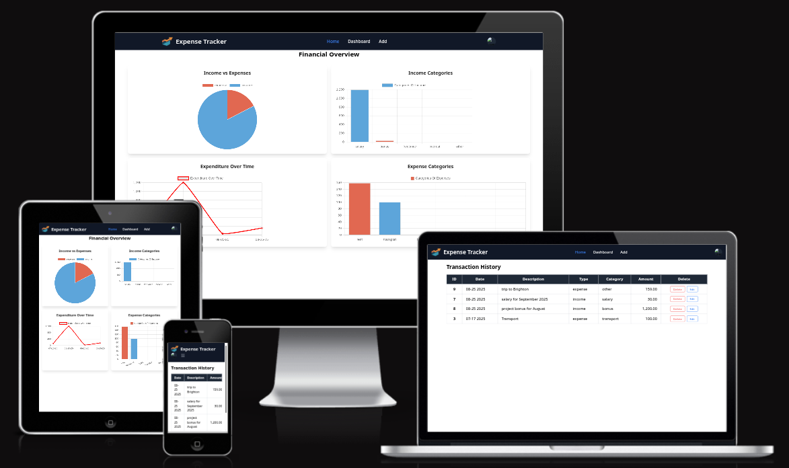
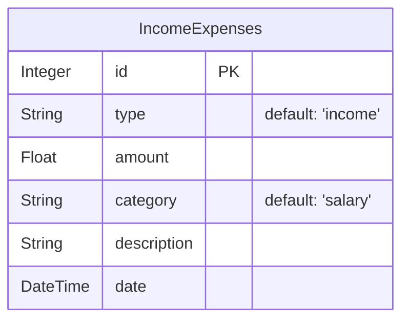

# Flask Expense Tracker



[Live Demo](https://budget.tomdcoding.net/)

[Python | Flask] Simple expense tracker with dashboard

## Setup

For the development we are using [uv](https://github.com/astral-sh/uv), an extremely fast Python package and project manager, written in Rust.

```bash
uv run main.py
```

For the tailwind css we are using [Tailwind Flask Starter](https://github.com/themesberg/tailwind-flask-starter). In order to use it, if not installed yet, run:

```bash
npm install
```

Then run in the background:

```bash
npx tailwindcss -i ./app/static/src/input.css -o ./app/static/dist/output.css --watch
```

Run the flask app:

```bash
uv run main.py
```

### Running with Uvicorn

To run the Flask app with Uvicorn, you can use the following command:

```bash
uvicorn main:app --reload
```

### Running with Docker

To run the application with Docker, you first need to build the Docker image and then run the container.

**1. Build the Docker image:**

```bash
docker build -t flask-expense .
```

**2. Run the Docker container:**

```bash
docker run -p 5000:5000 -e FLASK_APP=main.py flask-expense
```

### Running with Docker Compose

To run the application with Docker Compose, you can use the following command:

```bash
docker-compose up
```

This will build the image and run the container in one step. The application will be available at [http://localhost:5000](http://localhost:5000).

The `docker-compose.yml` file is configured to use a `.env` file for environment variables. You can create a `.env` file by copying the `.env-sample` file:

```bash
cp .env-sample .env
```

Then, you can edit the `.env` file to set the necessary environment variables.

## Deployment

The app is deployed on [Oracle Cloud Infrastructure](https://www.oracle.com/cloud/infrastructure/index.html) using [Coolify](https://coolify.io/). The deployed link is [https://budget.tomdcoding.net](https://budget.tomdcoding.net).

## Tech Stack

- **Programming Languages:** Python, JavaScript, HTML/CSS
- **Frameworks & Libraries:**
  - **Backend:** Flask, Flask-SQLAlchemy, Flask-WTF, Gunicorn
  - **Frontend:** Tailwind CSS, Flowbite, Chart.js
- **Database:** Neon Postgres
- **Deployment:** Docker, Docker Compose, Oracle Cloud Infrastructure, Coolify
- **Package Management:** uv, npm

## Database

The application uses a **Neon Postgres** database to store expense and income data.

### Relational Database Schema (Mermaid)



### Table Description

#### `IncomeExpenses`

This table stores the income and expense records.

| Column      | Data Type | Description                                                  |
|-------------|-----------|--------------------------------------------------------------|
| `id`        | Integer   | Primary key for the table.                                   |
| `type`      | String    | Type of the record, either 'income' or 'expense'.            |
| `amount`    | Float     | The amount of money for the record.                          |
| `category`  | String    | Category of the income or expense (e.g., 'salary', 'groceries'). |
| `description` | String    | A brief description of the record.                           |
| `date`      | DateTime  | The date and time when the record was created.               |


## Acknowledgements

- [Flask](https://flask.palletsprojects.com/en/2.0.x/) - A micro web framework written in Python.
- [Uv](https://github.com/astral-sh/uv) - A fast Python package and project manager written in Rust.
- [Coding with Prince - Flask Dashboard](https://www.youtube.com/watch?v=SLftzEqoLPk&list=PLU7aW4OZeUzwn6L1txXQ9viaAIR2mDqbv) - A helpful tutorial to build a dashboard with Flask.
- [Flowbite: Gettting Started/Flask](https://flowbite.com/docs/getting-started/flask/) - instruction on how to install Tailwind CSS Flask and Flowbite
- [Tailwind Flask Starter](https://github.com/themesberg/tailwind-flask-starter)
- [Chart.js](https://www.chartjs.org/docs/latest/getting-started/) -  it's a JavaScript library for creating interactive charts and graphs on the web.

## License

[MIT](https://choosealicense.com/licenses/mit/)

## Author

&copy; 2025 [Tomislav Dukez](https://github.com/tomdu3).